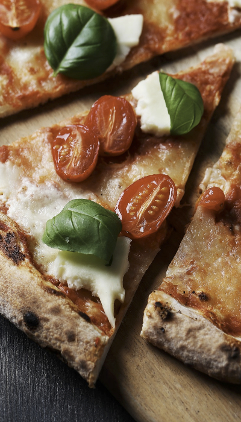

<div align="center">

# 🍕 Banafsh Restaurant
### *A Persian Restaurant Landing Page — Sleek, Responsive & Zero Dependencies*

<br/>


<br/>

> A fully Persian, RTL-supported restaurant website built with **pure HTML & CSS** — no JavaScript, no frameworks, no build tools. Features an online table reservation form, food menu, customer reviews, and a modern purple-themed design.

</div>

---

## ✨ Features

- 🇮🇷 **Full Persian & RTL Support** — `dir="rtl"` and `lang="fa"` applied at the root level
- 📱 **Responsive Design** — looks great on mobile, tablet, and desktop
- ⚡ **Zero JavaScript** — pure HTML + CSS, nothing else
- 🖋️ **Vazirmatn Font** — top-tier Persian font loaded with `<link rel="preload">` for speed
- 🖼️ **Lazy Image Loading** — all images use `loading="lazy"` for faster page loads
- ♿ **Accessible Markup** — `alt` on every image, `aria-label` on interactive elements, semantic HTML5 tags throughout
- 🎨 **Normalize.css** — consistent styling across all browsers
- 🔝 **Floating Back-to-Top Button** — always visible, smooth anchor scroll

---

## 📸 Page Sections

```
┌──────────────────────────────────────────┐
│  🔷  Header — Logo · Navbar · Reserve CTA │
├──────────────────────────────────────────┤
│  🍔  Menu — Drinks · Burger · Fried · Pizza│
├──────────────────────────────────────────┤
│  💬  Customer Reviews — 6 testimonials    │
├──────────────────────────────────────────┤
│  🏠  About Us — Story + restaurant photo  │
├──────────────────────────────────────────┤
│  📞  Footer — Contact Info + Reserve Form │
└──────────────────────────────────────────┘
```

---

## 🗂️ Project Structure

```
restaurant-website/
├── index.html              # Main page structure
├── style.css               # All custom styles
├── normalize.css           # Cross-browser CSS reset
├── Font/
│   └── Vazirmatn-Thin.ttf  # Persian Vazirmatn font
└── image/
    ├── banafsh-logo.png    # Restaurant logo
    ├── banafsh.png         # Restaurant interior photo
    ├── drink.png           # Menu — drinks icon
    ├── burger.png          # Menu — burger icon
    ├── barbecue.png        # Menu — fried food icon
    ├── pizza.png           # Menu — pizza icon
    ├── peyman.png          # Customer avatar
    ├── melika.png          # Customer avatar
    ├── hamid.png           # Customer avatar
    ├── mohsen.png          # Customer avatar
    ├── roya.png            # Customer avatar
    ├── omid.png            # Customer avatar
    ├── location.svg        # Contact — address icon
    ├── mail.svg            # Contact — email icon
    ├── phone.svg           # Contact — phone icon
    ├── arrow.svg           # Back-to-top arrow icon
    └── fav.png             # Favicon
```

---

## 🧩 Key Code Sections

### 🔷 Header & Navbar

Four anchor links scroll smoothly to each section of the page:

```html
<header class="header" id="header">
  <nav class="navbar">
    <a href="#menu" class="nav-item">Menu</a>
    <a href="#about-us" class="nav-item">About Us</a>
    <a href="#comments" class="nav-item">Reviews</a>
    <a href="#footer" class="nav-item">Contact</a>
  </nav>
  
  <a href="#reserve-form" class="button button-yellow">Reserve a Table</a>
</header>
```

---

### 🍔 Menu — 4 Categories

| Item | Description |
|------|-------------|
| 🥤 Drinks | Hot and cold beverages |
| 🍔 Burger | Specialty burgers with fresh meat |
| 🍗 Fried | Crispy fried dishes |
| 🍕 Pizza | Italian pizzas with a signature recipe |

Menu cards use semantic `<figure>` + `<figcaption>` elements:

```html
<figure class="menu-item">
  
  <figcaption class="menu-item-text">
    <h2>Pizza</h2>
    <p>Italian pizzas with a signature recipe</p>
  </figcaption>
</figure>
```

---

### 💬 Customer Reviews

Six customer testimonials rendered in a CSS grid layout:

| Customer | Review |
|----------|--------|
| Peyman | "Amazing food and a wonderful atmosphere. I'll definitely be back." |
| Melika | "Best restaurant I've ever been to. Exceptional service and food." |
| Hamid | "Banafsh's pizzas are unbeatable. Highly recommended." |
| Mohsen | "Great value for money. Parking available too." |
| Roya | "Beautiful decor and great music. A truly great experience." |
| Omid | "You have to try their special burger — absolutely worth it." |

---

### 📋 Online Reservation Form

A complete HTML5 form with `required` validation — no JavaScript needed:

| Field | Type | Details |
|-------|------|---------|
| Full Name | `text` | Required |
| Phone Number | `tel` | Required |
| Party Size | `select` | 1 to 7 guests |
| Reservation Time | `select` | 12:00 PM – 9:00 PM |

```html
<form action="#" method="POST" class="form" id="reserve-form">
  <h2>Reserve a Table Online</h2>
  <input type="text" name="name" class="input" placeholder="Full Name" required />
  <input type="tel" name="phone" class="input" placeholder="Phone Number" required />
  <select name="people" class="input" required>
    <option value="1">1 Guest</option>
    <!-- ... up to 7 -->
  </select>
  <select name="time" class="input" required>
    <option value="12:00">12:00 PM</option>
    <!-- ... up to 21:00 -->
  </select>
  <button type="submit" class="form-button">Submit Request</button>
</form>
```

---

### 📞 Contact Information

| | |
|--|--|
| 📍 Address | Tehran, Shahidan Square, Shahidan St., No. 12 |
| 📧 Email | [info@banafsh.com](mailto:info@banafsh.com) |
| 📞 Phone | +98-21-22222222 |

---

## 🚀 Getting Started

No installation required. Just clone and open:

```bash
git clone https://github.com/Mortezamohasebati/restaurant-website.git
cd restaurant-website
```

Open `index.html` directly in any modern browser:

```bash
# macOS
open index.html

# Windows
start index.html

# Linux
xdg-open index.html
```

Or use **Live Server** in VS Code for hot-reload during development.

---

## 🎨 Brand Colors

| Color | Usage |
|-------|-------|
| 🟣 Purple `#8B5CF6` | Primary brand color — buttons, headings, accents |
| 🟡 Yellow | "Reserve a Table" CTA button, highlights |
| ⚪ White | Backgrounds, text on dark surfaces |

---

## 🛠️ Technologies

| Technology | Role |
|------------|------|
| **HTML5** | Semantic page structure (`<header>`, `<main>`, `<footer>`, `<section>`, `<figure>`) |
| **CSS3** | Styling — Flexbox, Grid, custom properties, responsive layout |
| **Normalize.css** | Cross-browser CSS baseline reset |
| **Vazirmatn** | Persian typeface loaded via `@font-face` with `preload` |

---

## 🔮 Possible Future Improvements

- [ ] JavaScript hamburger menu for mobile navigation
- [ ] Connect reservation form to a backend or service like [Formspree](https://formspree.io)
- [ ] Scroll-triggered animations using Intersection Observer API
- [ ] Dark Mode toggle
- [ ] Full menu page with item descriptions and prices
- [ ] Restaurant photo gallery / lightbox
- [ ] Google Maps embed in the footer

---

## 📜 License

This project is open source and free to use for educational and personal purposes.

---

<div align="center">

Made with ❤️ by [Morteza Mohasebati](https://github.com/Mortezamohasebati)

</div>
