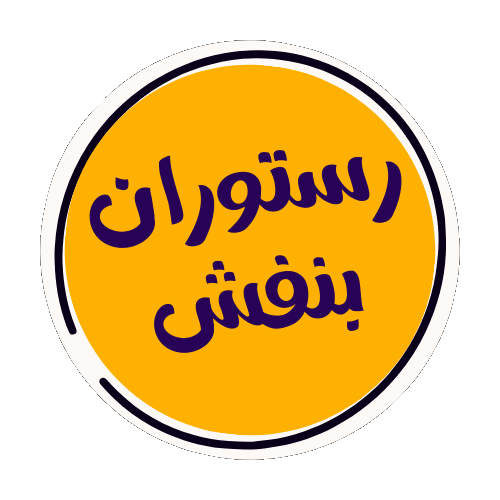
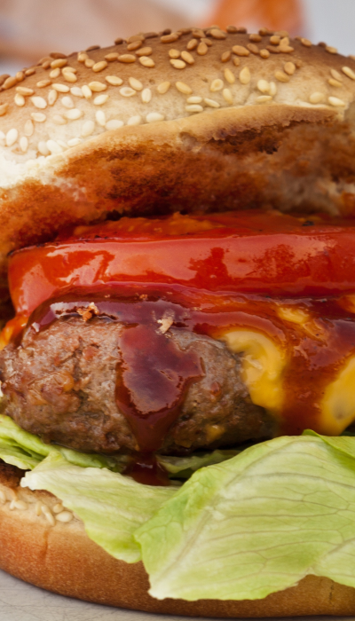

<div align="center">

# 🍕 رستوران بنفش
### *یه وب‌سایت رستوران فارسی — خفن، ریسپانسیو و بدون هیچ فریم‌ورکی*

<br/>


<br/>

> یه لندینگ‌پیج کامل برای رستوران بنفش — با فارسی کامل، پشتیبانی RTL، رزرو آنلاین میز، منو، نظرات مشتریان و طراحی مدرن. فقط با HTML و CSS خالص.

</div>

---

## 🌟 ویژگی‌ها

- 🇮🇷 **کاملاً فارسی و RTL** — از هدر تا فوتر، همه چیز راست به چپ
- 📱 **ریسپانسیو** — روی موبایل، تبلت و دسکتاپ خوش‌نشین
- ⚡ **بدون هیچ جاوااسکریپت** — فقط HTML + CSS ناب
- 🖋️ **فونت وزیرمتن** — بهترین فونت فارسی با `preload` برای سرعت
- 🖼️ **Lazy Loading تصاویر** — لود سریع‌تر صفحه با `loading="lazy"`
- ♿ **Accessible** — `alt` برای همه تصاویر، `aria-label` برای دکمه‌ها
- 🎨 **Normalize.css** — استایل یکسان در همه مرورگرها
- 🔝 **دکمه بازگشت به بالا** — فلوتینگ و همیشه در دسترس

---

## 📸 بخش‌های وب‌سایت

```
┌─────────────────────────────────────┐
│  🔷 هدر + ناوبار + دکمه رزرو       │
├─────────────────────────────────────┤
│  🍔 بخش منو (نوشیدنی/برگر/سوخاری/پیتزا)│
├─────────────────────────────────────┤
│  💬 نظرات مشتریان (۶ نظر واقعی)    │
├─────────────────────────────────────┤
│  🏠 درباره ما + تصویر رستوران       │
├─────────────────────────────────────┤
│  📞 اطلاعات تماس + فرم رزرو آنلاین  │
└─────────────────────────────────────┘
```

---

## 🗂️ ساختار پروژه

```
restaurant-website/
├── index.html          # ساختار اصلی صفحه
├── style.css           # تمام استایل‌های سفارشی
├── normalize.css       # نرمال‌سازی CSS برای مرورگرها
├── Font/
│   └── Vazirmatn-Thin.ttf   # فونت فارسی وزیرمتن
└── image/
    ├── banafsh-logo.png     # لوگوی رستوران
    ├── banafsh.png          # تصویر فضای رستوران
    ├── drink.png            # آیکون نوشیدنی
    ├── burger.png           # آیکون برگر
    ├── barbecue.png         # آیکون سوخاری
    ├── pizza.png            # آیکون پیتزا
    ├── peyman.png           # تصویر مشتری
    ├── melika.png           # تصویر مشتری
    ├── hamid.png            # تصویر مشتری
    ├── mohsen.png           # تصویر مشتری
    ├── roya.png             # تصویر مشتری
    ├── omid.png             # تصویر مشتری
    ├── location.svg         # آیکون آدرس
    ├── mail.svg             # آیکون ایمیل
    ├── phone.svg            # آیکون تلفن
    ├── arrow.svg            # آیکون فلش بالا
    └── fav.png              # فاویکون
```

---

## 🧩 بخش‌های کد

### 🔷 هدر و ناوبار
ناوبار با ۴ لینک anchor به بخش‌های مختلف صفحه. اسکرول نرم از طریق CSS:

```html
<header class="header" id="header">
  <nav class="navbar">
    <a href="#menu">منو</a>
    <a href="#about-us">درباره ما</a>
    <a href="#comments">نظرات</a>
    <a href="#footer">تماس با ما</a>
  </nav>
  
  <a href="#reserve-form" class="button button-yellow">رزرو میز آنلاین</a>
</header>
```

---

### 🍔 منو (۴ آیتم)

| آیتم | توضیح |
|------|-------|
| 🥤 نوشیدنی | انواع نوشیدنی‌های خنک و گرم |
| 🍔 برگر | برگرهای تخصصی با گوشت تازه |
| 🍗 سوخاری | سوخاری‌های لذیذ و ترد |
| 🍕 پیتزا | پیتزاهای ایتالیایی با دستور پخت ویژه |

کارت‌های منو با `<figure>` و `<figcaption>` برای accessibility کامل:

```html
<figure class="menu-item">
  
  <figcaption class="menu-item-text">
    <h2>برگر</h2>
    <p>برگرهای تخصصی با گوشت تازه</p>
  </figcaption>
</figure>
```

---

### 💬 نظرات مشتریان
۶ نظر واقعی از مشتریان رستوران در قالب کارت‌های گرید:

> **پیمان:** غذای فوق‌العاده خوشمزه و محیط دلنشین. حتماً دوباره میام.
> **ملیکا:** بهترین رستورانی که تا حالا رفتم. سرویس عالی و غذاهای بی‌نظیر.
> **امید:** پیشنهاد میکنم حتماً برگر مخصوصشون رو امتحان کنید.

---

### 📋 فرم رزرو آنلاین
فرم کامل با اعتبارسنجی HTML5 و `required`:

| فیلد | نوع | توضیح |
|------|-----|-------|
| نام و نام خانوادگی | `text` | الزامی |
| شماره تماس | `tel` | الزامی |
| تعداد نفرات | `select` | ۱ تا ۷ نفر |
| زمان رزرو | `select` | ساعت ۱۲ تا ۲۱ |

---

### 📞 اطلاعات تماس

| | |
|--|--|
| 📍 آدرس | تهران، میدان شهیدان، خیابان شهیدان، پلاک ۱۲ |
| 📧 ایمیل | info@banafsh.com |
| 📞 تلفن | ۰۲۱-۲۲۲۲۲۲۲۲ |

---

## 🚀 اجرا

هیچ چیزی نیاز به نصب ندارد! فقط:

```bash
git clone https://github.com/Mortezamohasebati/restaurant-website.git
cd restaurant-website
```

سپس فایل `index.html` رو مستقیماً توی مرورگر باز کن:

```bash
# macOS
open index.html

# Windows
start index.html

# Linux
xdg-open index.html
```

یا با **Live Server** در VS Code برای تجربه بهتر در حین توسعه.

---

## 🎨 رنگ‌بندی اصلی

| نام | کاربرد |
|-----|---------|
| 🟣 بنفش | رنگ اصلی برند، دکمه‌ها، عناوین ویژه |
| 🟡 زرد | دکمه رزرو آنلاین، هایلایت‌ها |
| ⚪ سفید | پس‌زمینه، متون روی رنگ تیره |

---

## 🛠️ تکنولوژی‌ها

| تکنولوژی | نسخه | کاربرد |
|----------|------|--------|
| **HTML5** | — | ساختار و Semantic markup |
| **CSS3** | — | استایل، Flexbox، Grid، انیمیشن |
| **Normalize.css** | — | یکسان‌سازی استایل پیش‌فرض مرورگرها |
| **Vazirmatn** | — | فونت فارسی |

---

## 🔮 ایده‌های توسعه آینده

- [ ] اضافه کردن JavaScript برای منوی موبایل (Hamburger Menu)
- [ ] اتصال فرم رزرو به Backend یا سرویسی مثل Formspree
- [ ] اضافه کردن انیمیشن‌های اسکرول با Intersection Observer
- [ ] Dark Mode
- [ ] صفحه منوی کامل با قیمت‌ها
- [ ] گالری تصاویر رستوران

---

## 📜 لایسنس

این پروژه متن‌باز است و برای استفاده آزاد و آموزشی در دسترس است.

---

<div align="center">

ساخته شده با ❤️ توسط [Morteza Mohasebati](https://github.com/Mortezamohasebati)

</div>
